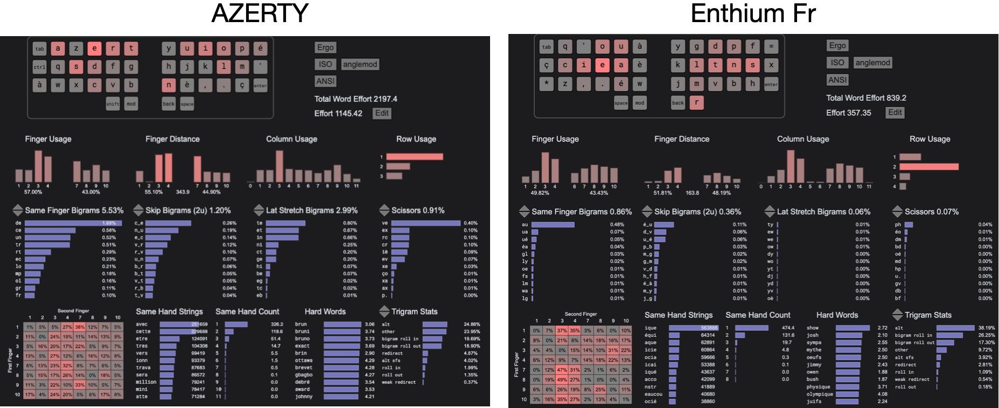
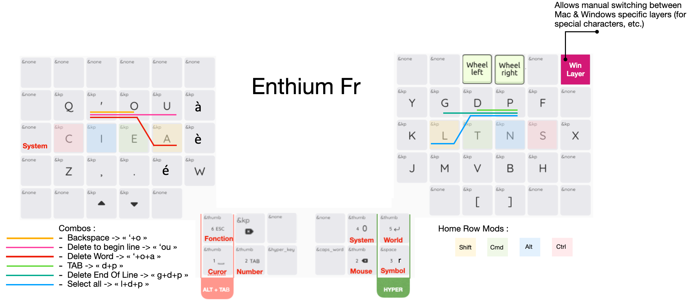
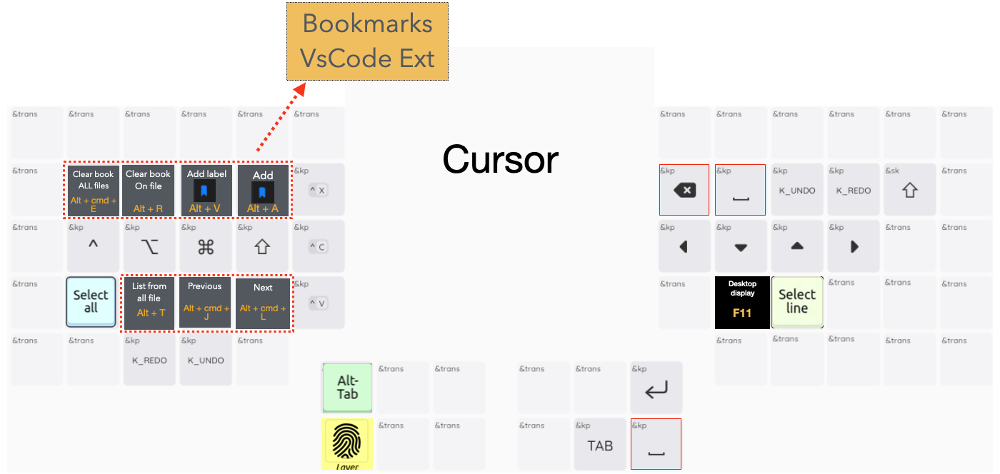
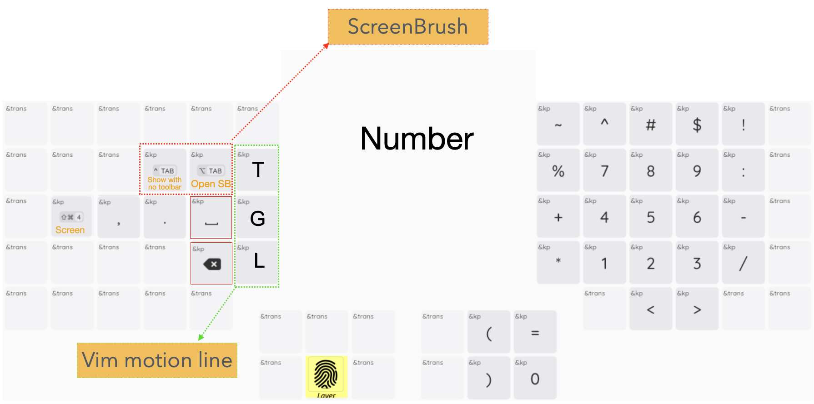
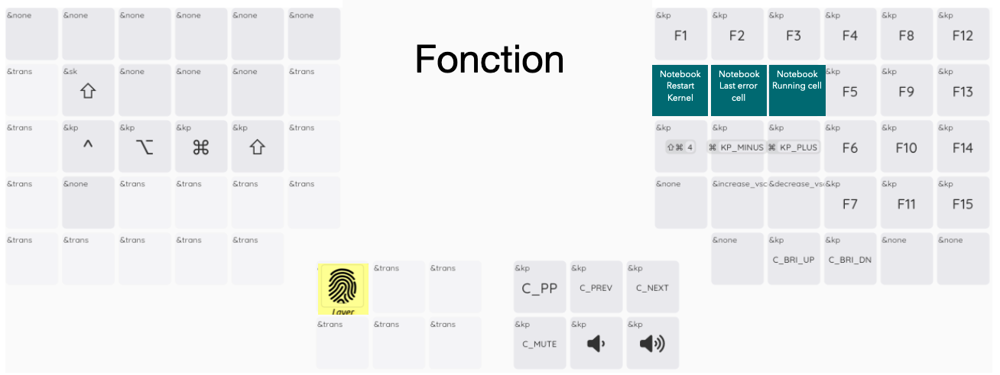
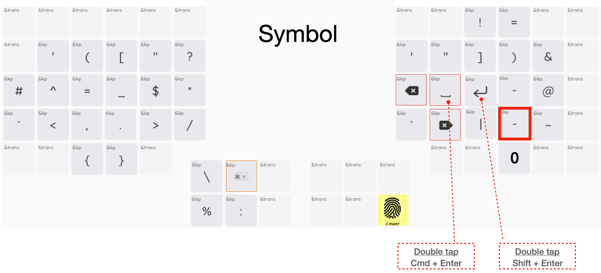
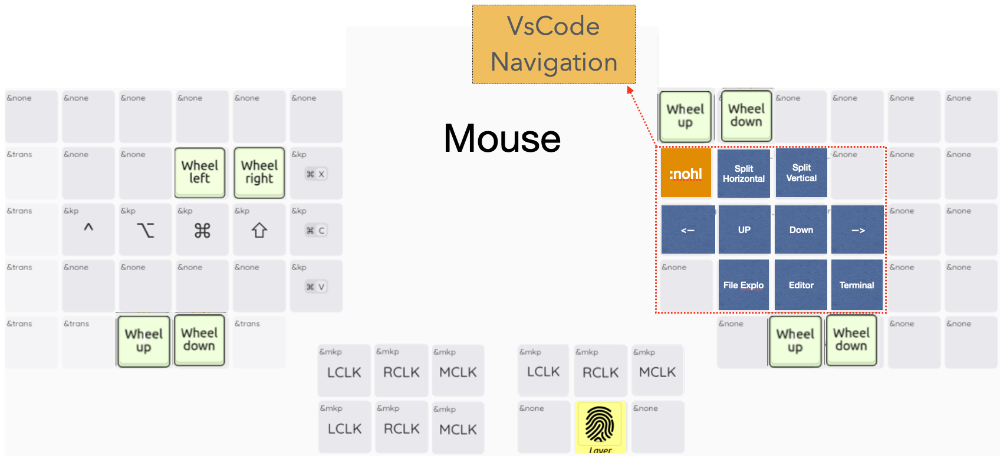
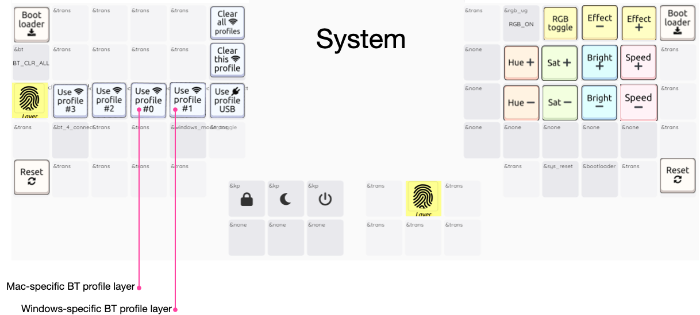
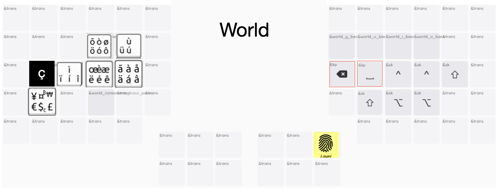

# ZMK Configuration Template
Wireless Cyboard keyboard configuration repository template for using ZMK firmware. [Instructions for use are located on our documentation site](https://docs.cyboard.digital/user-manual/quick-start/configure-layout).

## Main Features of `imprint.keymap`

- **Layer System:**  
  Multiple layers for custom layout, symbols, numbers, navigation, mouse, and system controls.  
  Temporary layers (e.g., cursor, symbol, number) can be accessed from any main layer.

- **Home Row Mods:**  
  Home row keys can act as modifiers when held, improving typing efficiency.

- **Combos and Macros:**  
  Combos for common shortcuts (e.g., Alt+Tab switcher) and special character input.  
  Macros for Unicode and Compose sequences, supporting both Mac and Windows input methods.

- **Custom Accent Characters:**  
  Direct access to accented characters (é, è, ê, ç, ü, ô, etc.) with OS-specific handling as I'am French.

- **Multi-OS Layouts:**  
  Easily switch between Mac and Windows specific layers. Each OS layer provides adapted shortcuts and character access (accents, symbols, etc.).

  Reproduction of common navigation shortcuts (Mac) into Windows and ZMK layers for consistency across platforms:

| Action                              | Mac                      | Windows                  | ZMK Windows                      |
|--------------------------------------|--------------------------|--------------------------|-----------------------------------|
| Aller au début de la ligne           | Cmd + ←                  | Home                     | HOME                              |
| Aller à la fin de la ligne           | Cmd + →                  | End                      | END                               |
| Sélectionner jusqu'au début de la ligne | Shift + Cmd + ←        | Shift + Home             | LS(HOME)                          |
| Sélectionner jusqu'à la fin de la ligne | Shift + Cmd + →        | Shift + End              | LS(END)                           |
| Reculer d'un mot                     | Alt + ←                  | Ctrl + ←                 | LC(LEFT)                          |
| Avancer d'un mot                     | Alt + →                  | Ctrl + →                 | LC(RIGHT)                         |
| Sélectionner le mot précédent        | Shift + Alt + ←          | Shift + Ctrl + ←         | LS(LC(LEFT))                      |
| Sélectionner le mot suivant          | Shift + Alt + →          | Shift + Ctrl + →         | LS(LC(RIGHT))                     |

- **Bluetooth Profile Integration:**  
  Bluetooth slot selection automatically activates the corresponding OS layer (e.g., slot 0 for Mac, slot 1 for Windows).

## Layout

Custom layout inspired by [Sunaku’s enthium](https://github.com/sunaku/enthium) and adapted for French language (but still good for English too!) named `Enthium FR`.

Comparaison on [cyanophage](https://cyanophage.github.io/) between default AZERTY layout and this custom layout:

## Inspiration

This configuration is inspired by [Sunaku](https://sunaku.github.io/index.html#moergo-glove80-keyboard)’s keyboard layouts and design philosophy on the Glove80 keyboard <3.

## Acknowledgments

Special thanks to the `Glove80` and the Cyboard `Imprint` community for their support, resources, and inspiration throughout the development!

## Layers Overview

