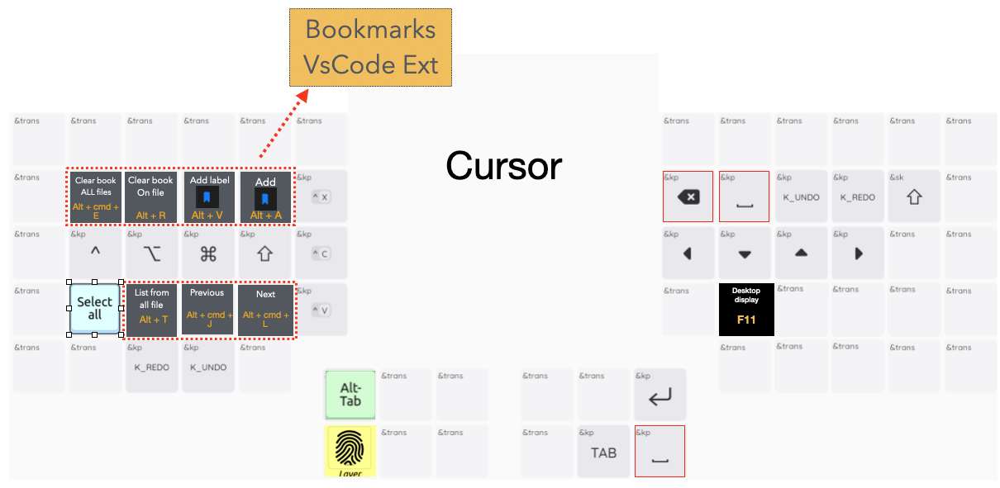
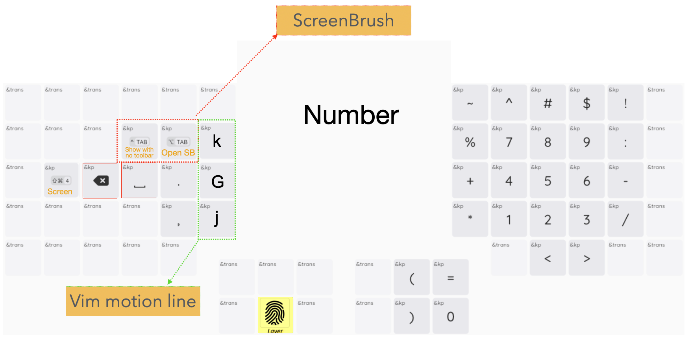
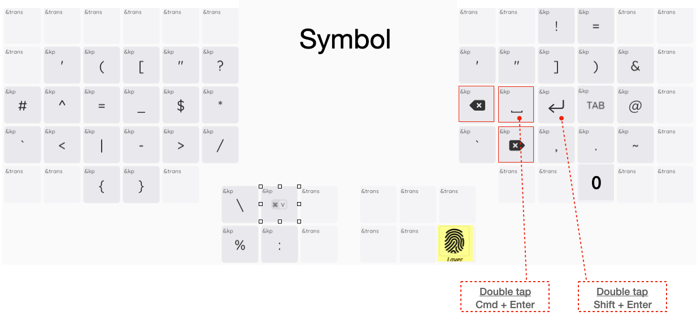
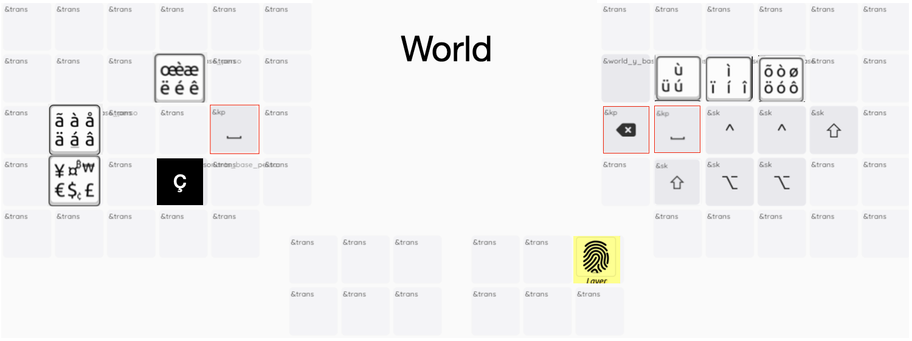

# ZMK Configuration Template
Wireless Cyboard keyboard configuration repository template for using ZMK firmware. [Instructions for use are located on our documentation site](https://docs.cyboard.digital/user-manual/quick-start/configure-layout).

## Main Features of `imprint.keymap`

- **Layer System:**  
  Multiple layers for custom QWERTY, symbols, numbers, navigation, mouse, and system controls.  
  Temporary layers (e.g., cursor, symbol, number) can be accessed from any main layer.

- **Home Row Mods:**  
  Home row keys can act as modifiers when held, improving typing efficiency.

- **Combos and Macros:**  
  Combos for common shortcuts (e.g., Alt+Tab switcher) and special character input.  
  Macros for Unicode and Compose sequences, supporting both Mac and Windows input methods.

- **Custom Accent Characters:**  
  Direct access to accented characters (é, è, ê, ç, ü, ô, etc.) with OS-specific handling as I'am French.

- **Multi-OS Layouts:**  
  Easily switch between Mac and Windows specific layers. Each OS layer provides adapted shortcuts and character access (accents, symbols, etc.).

- **Bluetooth Profile Integration:**  
  Bluetooth slot selection automatically activates the corresponding OS layer (e.g., slot 0 for Mac, slot 1 for Windows).

## Inspiration

This configuration is inspired by [Sunaku](https://sunaku.github.io/index.html#moergo-glove80-keyboard)’s keyboard layouts and design philosophy on the Glove80 keyboard <3.

## Acknowledgments

Special thanks to the `Glove80` and the Cyboard `Imprint` community for their support, resources, and inspiration throughout the development!

## Layers Overview

